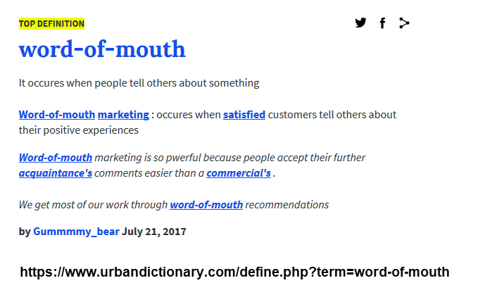
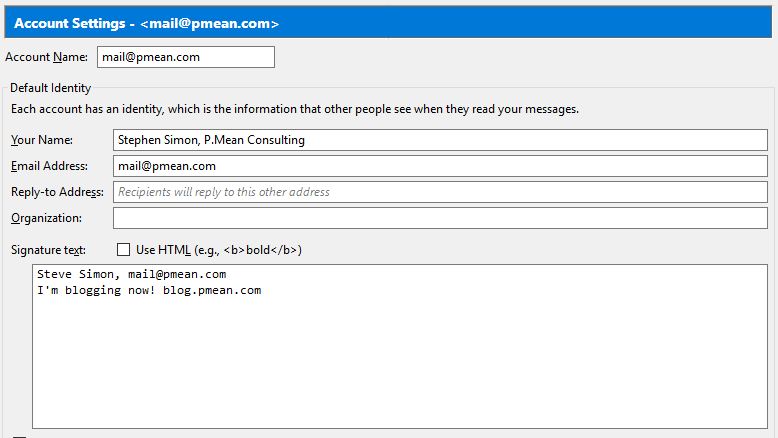
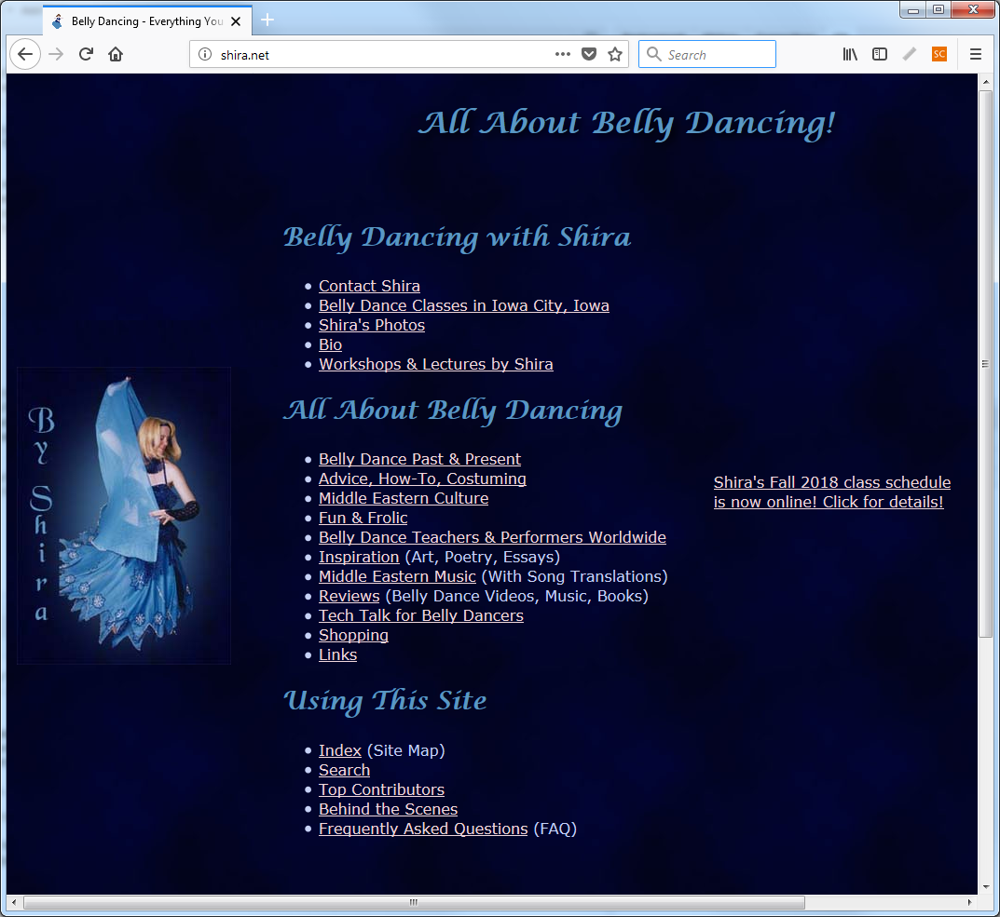

## Abstract

If you want to set up your own consulting business, you need to get the word out to potential customers. This webinar will compare and contrast the traditional approaches (such as giving talks and volunteering) to “old school” Internet (such as websites and email newsletters) to social media (such as Facebook and Twitter). 

I won't read this whole abstract, but to get customers, you have to get "known." And getting known can be done with traditional approaches, old school internet, and social media.

## Abstract (continued)

The key to all three approaches is that you give away small samples of what you know for free to establish your credibility and build up a network of contacts.

* These slides are available at http://github.com/pmean/finding-customers.

The commonality of all these approaches is that they are free from a money standpoint, but do require an investment of time.

Before I dive into this talk, I should mention that these slides were produced using R Markdown. It's silly to use R Markdown for a presentation that includes no R code or output, but I like how R Markdown allows me to work from a plain text file. You can find the R Markdown code, the image files, and the Powerpoint file on the github site listed above.

## Why am I giving this talk?

Totally clueless in 2008 when I started my own practice, so I decided to share what I learned.

Some of my recent talks/articles on consulting

* 2015 Conference on Statistical Practice

* 2016 Joint Statistical Meeting

* 2017 Conference on Statistical Practice

* 2017 Amstat News

* 2018 Statistical Consulting Section webinar

I'm very flattered to be invited here to talk to you (again!) about consulting. I started my own consulting business in 2008 and had to learn a lot very quickly. I decided to document what I learned and have shared it to make the process smoother and less anxiety-provoking for anyone else.

I've given talks at a variety of venues, and if anyone wants to invite me to write or talk more about this just let me know. I'd love to collaborate on a book about statistical consulting, if anyone is interested.

## The best way to find customers

By far the best way to find new customers is the "word of mouth." People want to hire someone that they know and trust. If they don't have anyone, they will ask an acquaintance or colleague who they know and trust. You want be the first person that this acquaintance or colleague thinks of when they are asked this question.

This talk will be split into two parts. The first half is taking advantage of the network of people you already have and the second half is expanding the network of people who know you.

## Spread the word to everyone you already know

* Your alma mater

* At the job you're leaving.

* Current customers (if you have them)

* Other statisticians

You will find that people from all sorts of places will end up recommending you. Don't miss a chance to let people know you are in the consulting business.

## Spreading the word, at your alma mater

* Faculty

* Fellow students

* Satisfy their natural curiosity

* "Staying in touch" emails

Your biggest supporters will be the faculty at the school where you got your degree. Your success makes them look better.

Your fellow students will disperse like dandelion seeds on the wind. They will meet lots of people and some of them might be your future clients.

Both groups will be naturally curious and will not at all mind hearing about this new career you're starting in consulting.

You should also find a way to stay in regular touch with them (more about that later).

## Spreading the word, at the job you're leaving

* Satisfy their natural curiosity.

* Do encourage them to recommend you.

* Don't poach.

* "Staying in touch" emails.

If you're leaving your old job on a good note, take advantage of the good will that you will have. People are naturally curious, so you have an opportunity to talk at length about your new career. Tell them about the clients you already have lined up and the types of clients that you are hoping to get.

It's okay to ask for recommendations, but beware of poaching (stealing business from your old company). Look for a "non-compete" clause in your hiring contract.

## Spreading the word, with your current customers

You may already have a few customers in the queue. If you do, take advantage of them as possible referral sources.

* At the first session

* One week/one month after completion

* "Staying in touch" emails

* Ask (but not too frequently) for repeat business

When you get a new customer, ask how they heard about you. If it was from an acquaintance, send that person a thank you note.

Wait a short time after completing your final report. "Just following up. Are you still happy with my work? Do you know anyone else who might want to hire me?"

Find an excuse every month or so to send a "staying in touch" email. I'll give some examples a bit later in this talk.

Less frequently (one in ten rule, discussed in a bit), you might ask how things are going and if there is anything new that you might be able to help with.

## Spreading the word, with your fellow statisticians

Your fellow statisticians might send you business because

* they can't consult,

* they don't want to consult,

* they want to consult, but not for this client.

You should never think of other statisticians as competing for your business. For me, they have been a regular source of referrals. They might not be able to consult themselves because of job restrictions, but they still want to help them out (and you at the same time). 

Even if they are in the business themselves, they may not feel qualified to handle a particular problem.

Or they might not like a particular type of client. I get a lot of referrals for PhD candidates who need a bit of help for their dissertation. Their committee needs to okay my involvement, but usually both they and the candidate are happy to get some help. Ph.D. candidates are a poor revenue source (they have short-term needs and are unlikely to provide repeat business). But I still like working with them, and appreciate anyone who can send these types of clients my way.

## Promoting yourself without 

The image on this page was found at https://commons.wikimedia.org/wiki/File:Spam_can.png and is licensed under the Creative Commons Attribution-Share Alike 4.0 International license. 

## Promoting yourself

To avoid the perception of spam, keep the following in mind:

* Timing (when and how often). 

* Relevancy (is there something of value to them?). 

* Restraint (keep it short and sweet). 

There's a fine line between self-promotion and spamming. Try your hardest to stay on the right side of the line. You don't want people to start tuning out your message because it is too frequent, too lengthy, and not relevant to their needs and interests.

## Timing

* Best at times of transition

  + Graduating
  
  + Leaving a job
  
  + Completing a big consulting project.

* Keep in touch, but not too often.

We've talked a bit already about timing. Curiosity is highest when you are graduating or when you are leaving your current job, so you have the opportunity to talk at length about what type of consulting clients you are hoping to attract. Keep in touch but don't pound them with emails. Try to avoid sending something more often than once a month. With current clients, the start of a new project and the end of new project is a great time to communicate.

## Relevancy

* Give your clients what THEY want, not what YOU want.

* Your goal is to be "unforgettable".

* Rule of one in ten for self promotion.

People don't mind emails if it includes something they want. You get almost as much accomplished by keeping your name in their short term memory than if you send out a blatant promotion of yourself without the risk of turning people off. You might get away with a brief email "I'm still looking for clients for my consulting business. Do you know anybody" once in a while but the rule of thumb is ten emails without any self-promotion for every self-promoting email.

## Restraint

* As short as you can get.

* Wait for a prompt before divulging lots of details.

There's a lot that you want to say about your consulting business, but those messages are more effective if they come after prompting. "I'm in consulting" "Oh what do you do?" will lead to a more productive exchange than "I'm a consultant. I specialize in statistical analyses involving health care issues. I'm looking for work involving both the planning and the analysis of clinical trials." 

## Introductions or re-introductions

* Mention the word "consultant" and emphasize your status with words like "independent" or "self-employed".

* Otherwise, keep it short.

* Wait for them to ask for more details.

When I introduce myself: "I'm an independent statistical consultant." The word "independent" implies "impartial" but also "on my own." Or let the person know you are self-employed.

If you get an inquiring response, have a response realdy. Tell them about the types of clients you have, or the types of analyses you do. Keep it short and sweet, again. "Most of my clients are Ph.D. candidates." or "I handle just about anyone: education, psychology, social work, medicine, just to name a few." or "I specialize in clinical trials."

## Simple email settings.

Getting the word out could be as simple as putting the name of your consulting company in your email name or in your signature file. Avoid a long signature file.

## "Just staying in touch" emails.

An occasional email from you helps keep you in the forefront of the thoughts of faculty, fellow students, old co-workers, and old clients.

* Find something of value to them and share it.

* Infrequent, but regular.

Always keep an eye open for interesting stuff: articles, websites, news. Send it along with a comment like "I saw this and thought of you." or "This is an interesting analysis that is similar to what we worked on."

Do this monthly or less frequently, but do it regularly. Most of the time, don't ask directly for referrals (one in ten rule). Think of it as a way to make yourself unforgettable.

## Business cards

* Always have a business card available to hand out.

* Gratefully accept any business cards you get.

* Write a few words on the back

* Follow up at least once with a brief email.

Keep a stack of business cards handy that mention that you are a consultant and that provides contact information, such as mailing address, phone number, email, and website. Aslo mention, if you have them, your Twitter handle, LinkedIn account, etc. 

Before you hand your business card to someone, write a few words on the back and write a brief note to yourself on the back of any card you get. This will remind them and you of the context in which the cards were exchanged.

A business card is a "one spam for free" card. No one who gives you a business card can complain if you send ONE email to them, so make a point of saying something short and sweet within a few days receiving their card. Remind them again of the context in which you exchanged cards and offer them something of value, if you can. Or ask for something of value (e.g., a copy of slides from their talk).

"I enjoyed chatting with you at the R Users Group. I wanted to share a copy of the paper where I talk about the new R package that I wrote."

Sending an email puts your email in the other person's email folder, in case they lose your card. You also have their email in your SENT folder in case you lose their card.

## Expanding the number of people who know you

If you can find a way to become famous, you will get a lot more referrals.

* Traditional approaches

* "Old school" internet

* Social Media (Web 2.0)

While taking advantage of faculty, fellow students, co-workers, etc. is a good idea, you also want to get your name out among people who don't know you.

There are several easy things you can do that can help make you famous. These can be broadly classified into traditional (non-Interent) approaches, old school Internet, and new school Internet, commonly called Social Media or Web 2.0.

All of these approaches cost next to nothing, but they are labor intensive.

## Traditional approaches

You don't need an Internet presence to become well known.

* Talking

* Writing

* Volunteering

People became famous before the Internet came along. They didn't need to "friend" several hundred people. They didn't need have their tweets retweeted. They didn't have to go viral. You can promote yourself the old fashioned way, by talking, writing, and volunteering.

## Talking

* Statistical talks for statisticians.

* Statistical talks for non-statisticians.

* Speak up (helpful questions) at other people's talks.

If you know something, talk about it. Talk at statistics gatherings, because fellow statisticians are a great referral source. But also talk before groups who might be potential clients.

Write up a brief introduction that you can offer to the person introducing you. Make sure it includes the fact that you are a consultant.

You also have an opportunity to talk at other people's presentations. Try to ask a helpful question during the talk or (better yet) right after the talk ends. If you are interested in their work, ask for a copy of their presentation.

## Writing

* Articles do not have to be peer-reviewed

* General or tutorial articles

* What do your customers read?

Writing articles is also a good way to get known, and the articles don't have to be peer-reviewed. General or tutorial artices might have as much or more of an impact than high-end research. Write for places that might be read by your fellow statisticians, but also write for places read by potential clients.

## Volunteering

* Help run an organization that relates to your skills and talents.

* Easy way for introverts to interact with strangers.

* Only volunteer if you have the time to do the job well.

Volunteering is another way to enhance your visibility. I am currently the President of the Kansas City R Users Group, and people make the assumption that someone with that title must know more about R than anyone else in the Kansas City area. This is most definitely not true, but I will not disabuse anyone of that false assumption.

Don't volunteer for something and then do a lousy job. You'll get a lot of negative publicity.

## "Old school" Internet

Applications of Internet technologies developed in the prior century. Largely considered obsolete, but still valuable.

* Email newsletters

* Email discussion groups

* Web sites

Even though everyone talks about the latest social media application, the "old school" Internet technologies: email and the World Wide Web are still useful tools.

An email newsletter provides a regular set of short articles distributed by email. Be sure to spend a bit of money on a professional vendor of email distribution software (Emma, Constant Contact). The well-known name, the opt-in subscription page, and the standard footer allowing unsubscription will help you avoid the perception that you are spamming people. 

There are many interesting email discussion groups, though these have to some extent been supplanted by web based discussion groups like Stack Overflow, but they still work the same way. Find a group where you can both ask and answer questions. A group where you only ask questions won't help you establish your authority. A group where you only answer questions will seem tedious after a while. Rule of thumb: answer four questions for every one question that you pose.

A static website is also very helpful. It can be as simple as a single page with contact information. Think of it as an electronic version of your business card.

## Web 2.0, what is it?

The hallmark of social media/Web 2.0 is a much higher degree of interactivity.

* Facebook

* LinkedIn

* Twitter

* Many others.

If you're confused by Web 2.0, I am too. It is a hectic game of musical chairs (is Google+ going to replace Facebook?) and every new Web 2.0 tool touts its special unique features. In essence, Web 2.0 refers to a class of new tools for creating and sharing information on the Internet. Web 2.0 offers relative ease in creating and publishing information. Web 2.0 also makes it easy for others to comment on and enhance the material that you publish.

Around the turn of the century, the Internet got a lot more interactive, and you will find communities that develop content collectively rather than a solo author putting up a series of articles.

These new approaches offer a sense of immediacy, but I find that they, at the same time, offer a lack of permanence. But lots of people have gotten good mileage out of these social media sites.

## How Web 2.0 helps

What does Social Media or Web 2.0 help with?

* Build a sense of familiarity.

* Self promotion is a bit easier with Social Media

* Don't try to do it all.

There is a lot of insipid stuff on social media, but that should not scare you away. A lot of people are using social media effectively to make a name for themselves and to promote their works.

Your goal, whether using Web 2.0 or more traditional approaches, is to build a level of familiarity with your potential customers. People don't like to hire total strangers. Sometimes they will but it is very scary. If someone knows you because they read your blog regularly, or because they follow your Twitter feeds, that reduces the fear factor somewhat.

This is really no different than why you use talking, writing, and volunteering.

One of the nice things about social media is that a bit of bragging is the norm. So you can say. "I just started a diet and lost three pounds in the first week." Take advantage of this and brag about things like "I just gave a webinar for the American Statistical Association on finding customers for your statistical consulting practice. Got a lot of interesting comments and questions." I think that the reason you can get away with a bit more is that people come to Social Media sites when (and only when) they are interested in things. 

## I like blogging

My recommendation for a primary area to promote your consulting business is a blog.

* Built in tools for tagging, searching

* Indexed by Google

* More interactive than a website

I like blogging and I see that this is one of the best approaches to get some recognition. A blog requires regular work. Make a commitment: one post every other day or two per month. The frequency is not as important as the regularity. Don't do a flurry of posts and then burn out.

Blogging software is the simplest example of a Web 2.0 application, and it is a very good starting point if you want to try out Web 2.0. A blog provides a straightforward way to create content, much easier than building a website from scratch. The blogging software can handle formatting and indexing for you. Some blogs even allow you to add new entries by email.  Most importantly, a blog (unlike a static website) offers your readers a chance to comment on what you've written. This is a double-edged sword, but it is mostly good.

## Blogs are not your only choice

* Look for communities with interests similar to yours

* Contribute content of value

* Don't try to master everything

I like to think of other Web 2.0 tools as variations on a blog (Twitter, in fact, is called a micro-blogging site). So everything I say about a blog applies just as well to other Web 2.0 tools. But these Web 2.0 tools do offer important features beyond a blog. The most common extra feature is the ability to create or join communities of people with similar interests. This is useful for your professional development (e.g., getting your data mining questions answered on a data mining group on LinkedIn) but if you regularly provide useful  resources for others as well, you develop an aura of expertise and you build up your name recognition.

You can't master every possible Social Media platform. Pick a primary area and use other areas to supplement your primary area. For example, put your best stuff on a blog and then use Twitter to announce when you've posted something on your blog.

## Your content

When you create content on the Internet, keep it

* fresh,

* focussed, and

* fun.

The most labor intensive part of social media is creating compelling content. What you write needs to be fresh, focussed, and fun.

## Fresh

* Regular entries.

* Short and sweet

* Highlight interesting resources

Fresh. You need to provide regular entries. It doesn't matter whether you write every other day or every other week, but make the commitment to update on a regular and predictable pattern. Don't start out too fast. You'll burn yourself out, and you'll also raise a level of expectation from your readers that you won't be able to maintain.

Keep everything short and sweet, both for your sake and for the sake of your readers.

If you are early in your career, you may have difficulty with writing good content. Don't let this stop you. An easy, and very valuable thing that anyone, even a beginner can do is to recommend interesting resources. Include a brief summary in your own words so people know what they are clicking on. Do this often enough in one area and you will have a very nice electronic version of an annotated bibliography. 

If you do offer links to other resources, do take the time to add something more descriptive than "Hey look at this interesting website I just found." No one likes to click on a link without first getting a hint as to what they will see when they reach that site. And please don't link to content that is stuck behind a pay wall.

## Focused

* Too much diversity and you'll never reach a critical mass of content.

* Find an under-served niche.

* Pick on Web 2.0 tool for your primary work.

Think carefully about what you will blog about. A wide ranging blog about anything and everything is likely to be too diffuse to be of interest. It will also be difficult to build up a critical mass of content when you tackle too broad a range of topics.

Find an under-served niche. There are over 750 R bloggers (www.r-bloggers.com), so you won't get much notice if you become the 751st blogger. If you must blog about R, pick a specialization within R, such as GIS applications, or you'll get lost in the crowd.

Focus also applies to the Web 2.0 tools that you choose to use. Select one tool as your primary focus and if you use others, use them mostly to supplement and support that primary focus. So, for example, focus mostly on a blog and use Twitter to update people when a new blog post appears. Or focus on Twitter, and use your blog as an archive for your tweets. There are many tools that help you update multiple Web 2.0 sites simultaneously. LinkedIn, for example, offers you the option of sharing updates on Twitter as well. But even with this type of assistance, you run the risk of spreading yourself too thinly.

## Fun

* Having fun is the best way to avoid burnout.

* Talk directly to your readers.

* Encourage your readers to talk back.

Most importantly, HAVE FUN. You avoid burnout if you do what you enjoy. I tried LinkedIn, and I never liked it. It seemed too stodgy and was overloaded with head hunters. I found Facebook more enjoyable, but some people hate its informality. Twitter is a challenge to some people but it may be the best for you if you thrive on "short and sweet" discussions.

Talk directly to your readers. You should try as much as possible to use the pronoun "you" rather than the pronoun "I" or the dreaded passive voice. Your blog is not the place to establish an aura of objectivity by adopting an encyclopedic tone.

Encourage your readers to talk back to you. Part of the value of a blog is that your readers can post comments on your blog posts. This can be scary, but these comments can add great value. Your readers  will feel a better emotional connection to you and see you as more as a colleague and peer. Stay vigilant, though, and remove off-topic or off-color responses. Bad commentary will reflect poorly on you.

## Fun

* Share (a little) about your personal life.

* No politics or religion.

Some people advocate keeping your personal life separate from your professional life, but I think it works to your advantage to share a little bit about yourself, your family, your hobbies, and your travels. It tends to humanize you and make you seem less of a stranger. Don't flood Facebook with hundreds of pictures of your cute dog, though. Your true friends will endure this and even pretend that they adore your dog as much as you do. But your professional contacts won't be so charitable.

Don't talk about politics or religion. You will narrow the scope of people who want to follow you. There are exceptions, such as political issues that impact statistical practice (such as U.S. Census issues).

## Great self-promotions

Two examples:

* Raynauld Levesque

  + SPSS macros

* Michael Chernick

  + Amazon book reviews

Raynauld Levesque found an underserved niche when he developed a website about SPSS (http://www.spsstools.net). It wasn't a general site about SPSS, but rather a site about syntax and macros in SPSS. His site became to "go to" site for the really tough problems in SPSS that required macro solutions. Other people started contributing macros to his site. What a wonderful success you have achieved when your site gets fresh content from your readers.

Michael Chernick developed a different niche. He produced reviews of Statistics textbooks for Amazon (http://www.amazon.com/gp/pdp/profile/AQ7ZQWXAYT8HZ). He has reviewed over 600 books and his reviews are always informative. It's impossible to look on Amazon for advanced applications in Statistics without repeatedly seeing his name next to a detailed review.

## Shira (Julie Elliot)

One of the best examples of self-promotion comes from a non-statistical area. A good friend of mine, Julie Elliot, has a wonderful website about belly dancing (shira.net). The content is great and you hardly notice the efforts at self-promotion. Also take a look at her Twitter feed (@shiradotnet), which reinforces content on her web page. She's one of the few people I know who knows how to do Twitter well.

Julie has also gotten a lot of the belly dancing community working with her. Notice the large number of articles on her website that are written by others.

## Some cautions

* Be aware of community standards.

* Emulate the behavior of others.

* Don't spend too much time on self-promotion.

Many Internet sites often evolve community standards about what is acceptable and what is not. These standards are often tacit and they can vary greatly across different sites. Even within a site there is substantial variation on what constitutes excessive self-promotion. The best thing to do is to watch how others behave and emulate them. If someone complains, apologize profusely and publicly. The worst thing you can do is argue, even if the complaint is unfounded. Let others in the community come to your defense if someone tries to enforce a standard more rigid that what the community as a whole prefers.

One final caution is to not spend too much time with Web 2.0 tools. These are usually very cheap and often free, but the trade-off is it takes time to produce information of enduring value. Don't skimp on your time, but you have to place limits, or these efforts will suck away your whole life.

## Summary

Promote yourself with people you already know. Expand your network of contacts through traditional means, old school Internet, and Web 2.0 or Social Media.

* A copy of these slides is available at https://github.com/pmean/finding-customers.

* Questions, comments? http://www.pmean.com/contact.html.

